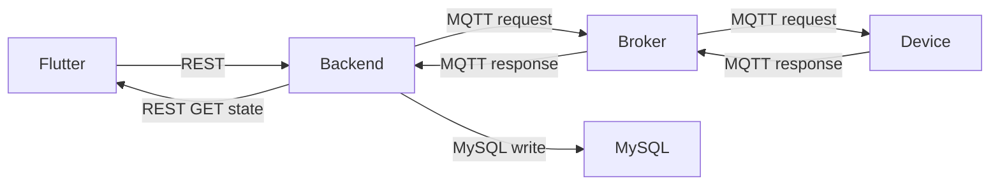

# Architecture (current)

This document describes the **current intended architecture** of the VuonRau IoT system.

## 1) Goals

- Control a water valve (relay).
- Collect sensor readings (starting with `humidity_raw`).
- Keep the system stable on a local network.
- Backend-centric: clients never talk to MQTT directly.

## 2) Components

### 2.1 Device firmware (ESP32 / ESP32-CAM)

- Subscribes to `device/{device_id}/request`
- Dispatches by `target` (typed control plane)
- Publishes to `device/{device_id}/response`:
  - `ack` and optionally `state`
  - periodic `sensor` readings (`readings` map)

### 2.2 MQTT broker (Mosquitto)

- Transport only.
- Backend and devices communicate only through MQTT topics.

### 2.3 Backend (Spring Boot)

- Single entry point for clients (Flutter).
- Bridges REST ↔ MQTT.
- Maintains latest device runtime state in memory (fast).
- Persists history to MySQL:
  - `sensor_readings`
  - `irrigation_log`
- Exposes capability registry for dynamic UIs.

### 2.4 Flutter app

- REST only.
- Must re-fetch `/state` after actions (no optimistic UI).
- Dashboard uses a small set of fixed cards; details page is dynamic.

## 3) Data flows

## 4) Invariants (do not break)

- Flutter MUST NOT talk to MQTT directly.
- MQTT `timestamp` is device uptime seconds.
- Unknown keys under `readings` MUST be ignored by backend.
- Keep control-plane targets stable (`water_valve`), extend by adding new targets rather than renaming.

## 5) Extension points

### 5.1 Add a new sensor

- Device publishes additional `readings.<sensor_code>`.
- Backend records it into `sensor_readings` and updates `/state.readings`.
- UI Details page should render it via capabilities + extensible maps.

### 5.2 Add a new actuator

- Define a new stable `target` string.
- Add firmware handler + NACK unknown targets.
- Add backend action validation and state merge logic.
- Optionally expose it in `/capabilities.actuators`.

